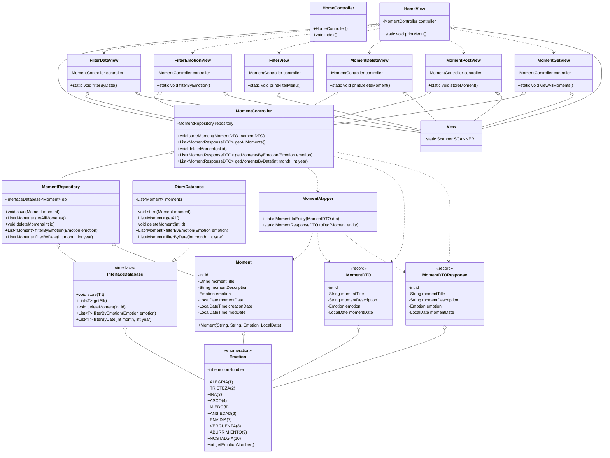

## Diagram

```mermaid
classDiagram
direction TB
    class HomeController {
        +HomeController()
        +void index()
    }

    class MomentController {
        -MomentRepository repository
        +void storeMoment(MomentDTO momentDTO)
        +List~MomentResponseDTO~ getAllMoments()
        +void deleteMoment(int id)
        +List~MomentResponseDTO~ getMomentsByEmotion(Emotion emotion)
        +List~MomentResponseDTO~ getMomentsByDate(int month, int year)
    }

    class MomentRepository {
        -InterfaceDatabase~Moment~ db
        +void save(Moment moment)
        +List~Moment~ getAllMoments()
        +void deleteMoment(int id)
        +List~Moment~ filterByEmotion(Emotion emotion)
        +List~Moment~ filterByDate(int month, int year)
    }

    class DiaryDatabase {
        -List~Moment~ moments
        +void store(Moment moment)
        +List~Moment~ getAll()
        +void deleteMoment(int id)
        +List~Moment~ filterByEmotion(Emotion emotion)
        +List~Moment~ filterByDate(int month, int year)
    }

    class InterfaceDatabase {
        <<interface>>
        +void store(T t)
        +List~T~ getAll()
        +void deleteMoment(int id)
        +List~T~ filterByEmotion(Emotion emotion)
        +List~T~ filterByDate(int month, int year)
    }

    class MomentMapper {
        +static Moment toEntity(MomentDTO dto)
        +static MomentResponseDTO toDto(Moment entity)
    }

    class Moment {
        -int id
        -String momentTitle
        -String momentDescription
        -Emotion emotion
        -LocalDate momentDate
        -LocalDateTime creationDate
        -LocalDateTime modDate
        +Moment(String, String, Emotion, LocalDate)
    }

    class MomentDTO {
        <<record>>
        -int id
        -String momentTitle
        -String momentDescription
        -Emotion emotion
        -LocalDate momentDate
    }

    class MomentDTOResponse {
        <<record>>
        -int id
        -String momentTitle
        -String momentDescription
        -Emotion emotion
        -LocalDate momentDate
    }

    class Emotion {
        <<enumeration>>
        -int emotionNumber
        +ALEGRIA(1)
        +TRISTEZA(2)
        +IRA(3)
        +ASCO(4)
        +MIEDO(5)
        +ANSIEDAD(6)
        +ENVIDIA(7)
        +VERGUENZA(8)
        +ABURRIMIENTO(9)
        +NOSTALGIA(10)
        +int getEmotionNumber()
    }
    
    class View {
        +static Scanner SCANNER
    }

    class FilterDateView {
        -MomentController controller
        +static void filterByDate()
    }

    class FilterEmotionView {
        -MomentController controller
        +static void filterByEmotion()
    }

    class FilterView {
        -MomentController controller
        +static void printFilterMenu()
    }

    class HomeView {
        -MomentController controller
        +static void printMenu()
    }

    class MomentDeleteView {
        -MomentController controller
        +static void printDeleteMoment()
    }

    class MomentPostView {
        -MomentController controller
        +static void storeMoment()
    }

    class MomentGetView {
        -MomentController controller
        +static void viewAllMoments()
    }

    MomentController o-- MomentRepository
    MomentController ..> MomentMapper
    MomentController ..> MomentDTO
    MomentController ..> MomentDTOResponse
    MomentRepository o-- InterfaceDatabase
    MomentRepository o-- Moment
    DiaryDatabase ..|> InterfaceDatabase
    MomentMapper ..> Moment
    MomentMapper ..> MomentDTO
    MomentMapper ..> MomentDTOResponse
    Moment o-- Emotion
    InterfaceDatabase o-- Emotion
    MomentDTO o-- Emotion
    MomentDTOResponse o-- Emotion
    
    HomeView o-- MomentController
    HomeView ..> FilterDateView
    HomeView ..> FilterEmotionView
    HomeView ..> FilterView
    HomeView ..> MomentDeleteView
    HomeView ..> MomentPostView
    HomeView ..> MomentGetView
    
    FilterDateView o-- MomentController
    FilterEmotionView o-- MomentController
    MomentDeleteView o-- MomentController
    MomentPostView o-- MomentController
    MomentGetView o-- MomentController
    
    HomeView <|-- View
    FilterDateView <|-- View
    FilterEmotionView <|-- View
    FilterView <|-- View
    MomentDeleteView <|-- View
    MomentPostView <|-- View
    MomentGetView <|-- View
```

## Test

