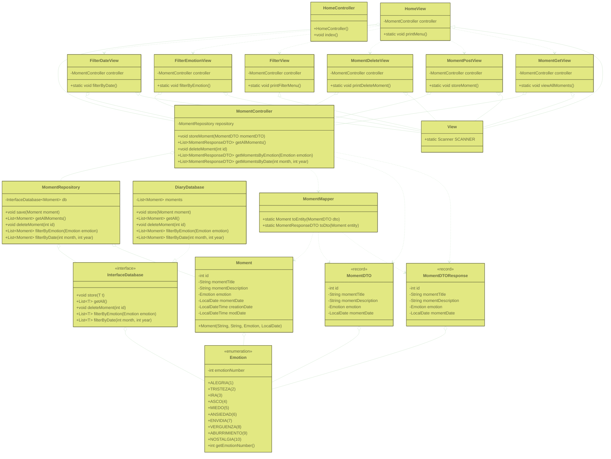
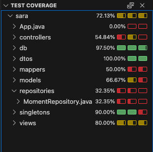

# My diary: A Personal Moments Manager

## Project Description
My Diary is a console application designed to help users manage and remember their life moments. The tool allows you to register each moment with a title, a description, and an assigned emotion, making it easy to review and organize them later. The program supports various functionalities, such as adding new moments, viewing all registered entries, deleting entries, and filtering them by emotion or date.

## Prerequisites
To run this project, you need the following installed on your system:
- Java Development Kit (JDK): Version 21.
- Maven: Version 2.8.1 or higher. The project was created using the maven-archetype-quickstart archetype.

## Class diagram

## Installation and Execution Steps
Follow these steps to get the project up and running:

1. Clone the Repository: Open your terminal and clone the project using the following command:
 ```
   git clone [https://github.com/sara-vazquez/insideOut-java]
   cd [isideout-directory]
 ```

2. Compile the Project: Use Maven to compile the source code.
```
mvn clean install
```

3. Run the Application: Once compiled, you can run the console application.
```
java -jar target/my-diario.jar
```

## Test coverage


## How to Run Tests
To run the project's unit tests and generate the coverage report, use the following Maven command:
mvn test
```
mvn test
```

